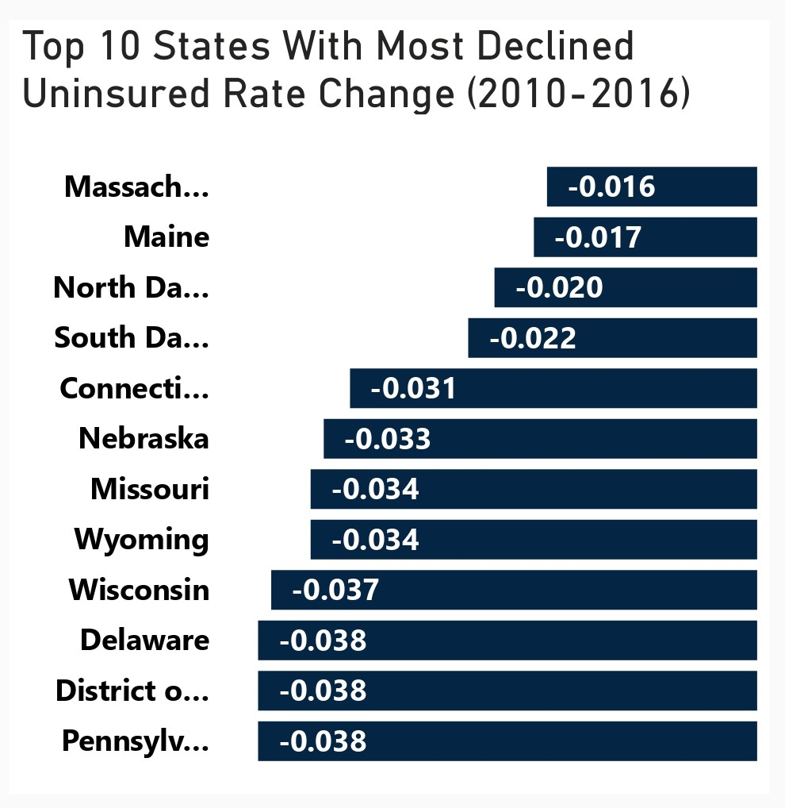
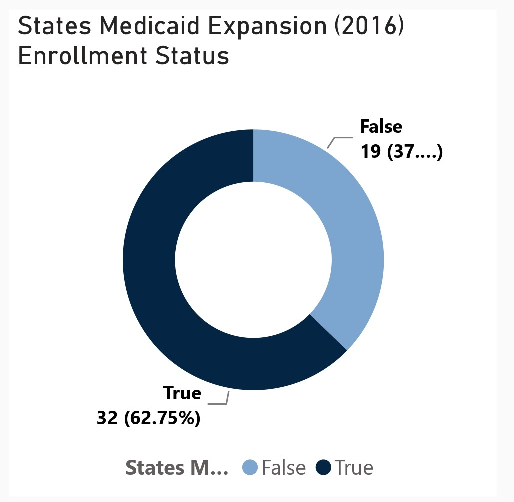
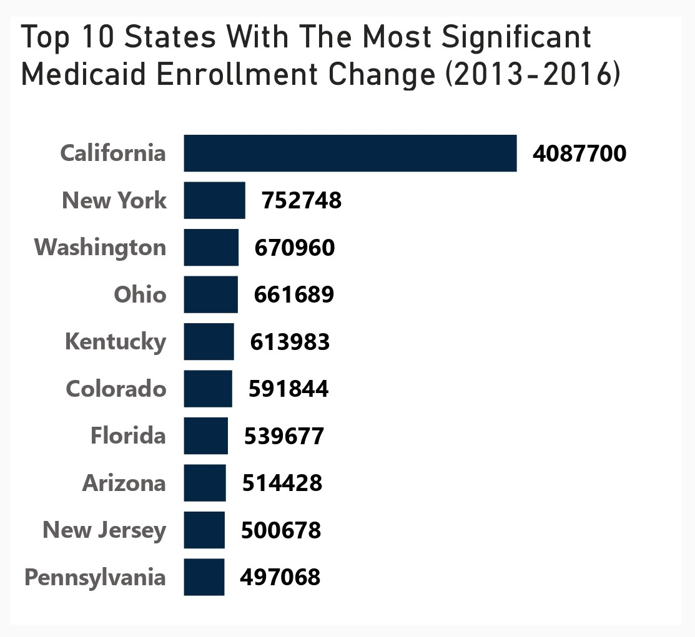

# US-Health-Insurance-Coverage-Analysis (2010-2016)

## Project Overview
### Introduction:
The Affordable Care Act (ACA), often colloquially referred to as Obamacare, stands as one of the most significant pieces of healthcare legislation in the United States in recent history. Enacted in March 2010 under the administration of President Barack Obama, the ACA aimed to address longstanding issues within the American healthcare system, including access, affordability, and quality of care. The period from 2010 to 2016 in the United States marked a significant chapter in healthcare. My project, "US Health Insurance Coverage Analysis (2010-2016)," dives into this era to uncover trends and impacts on coverage.

Through this data analysis, we aim to shed light on changes in uninsured rates, Medicaid enrollment, Medicare enrollment, marketplace exchanges, and employer-sponsored insurance. By understanding these trends, we hope to inform policymaking and contribute to ongoing efforts to improve healthcare access for all Americans. Join us as we draw insights from this popular health insurance coverage as we work towards a more equitable healthcare system.

### Objectives:
To conduct a comprehensive analysis of healthcare coverage metrics from 2010 to 2016, focusing on the top-performing states in various categories:
- Top States with the Most Declined Uninsured Rate (2010-2016): Identify and analyze the states that experienced the most significant reduction in uninsured rates over the six-year period. Investigate factors contributing to the decline in uninsured rates, such as Medicaid expansion, marketplace enrollment, and outreach initiatives.

- State Medicaid Expansion Enrollment Status (2016): Assess the Medicaid expansion status of states in 2016 and examine the impact of expansion on healthcare coverage and access.
Compare enrollment rates and healthcare outcomes between states that expanded Medicaid and those that did not.

- States with the Most Significant Medicaid Enrollment Change (2013-2016): Identify states with the largest changes in Medicaid enrollment from 2013 to 2016, including both increases and decreases. Explore factors driving changes in Medicaid enrollment, such as economic conditions, demographic shifts, and policy changes.

- States with the most significant Health Insurance Coverage Change (2010-2015): Analyze states with the most notable changes in health insurance coverage from 2010 to 2015, considering shifts in employer-sponsored coverage, Medicaid expansion, and marketplace enrollment. Examine variations in coverage change patterns across states and demographic groups.

- States by Average Monthly Credit (2016): Identify states where individuals received the highest average monthly tax credits for marketplace health insurance coverage in 2016.
Evaluate the effectiveness of tax credits in making health insurance coverage more affordable for residents.

- States by Marketplace Tax Credits (2016): Analyze states where individuals received the highest total amount of marketplace tax credits in 2016. Assess the distribution of tax credits across states and their impact on marketplace enrollment and affordability.

- States by Employee Health Insurance Coverage (2015), Marketplace Health Insurance Coverage (2016), Medicaid Enrollment (2016), and Medicare Enrollment (2016): Compare states based on levels of employee-sponsored health insurance coverage, marketplace enrollment, Medicaid enrollment, and Medicare enrollment. Examine variations in coverage sources and enrollment rates across states.

- Uninsured Rate Change By States (2010-2016): Create a geographic visualization of uninsured rate changes across states from 2010 to 2016. Highlight states with the most significant reductions or increases in uninsured rates and explore regional trends.

### Expected Outcome of Analysis Objectives:

- Top 10 States with the Most Declined Uninsured Rate (2010-2016): Identification of states with the most significant reductions in uninsured rates. Insights into factors contributing to the decline, such as Medicaid expansion and marketplace enrollment. Understanding of successful strategies for reducing uninsured rates that can inform future healthcare policy and outreach initiatives.

- State Medicaid Expansion Enrollment Status (2016): Assessment of Medicaid expansion's impact on healthcare coverage and access. Comparison of enrollment rates and healthcare outcomes between states that expanded Medicaid and those that did not.
  
- Top 10 States with the Most Significant Medicaid Enrollment Change (2013-2016): Identification of states experiencing the largest changes in Medicaid enrollment. Understanding of economic, demographic, and policy factors driving enrollment changes. Insights into the effectiveness of Medicaid expansion and other enrollment initiatives.

- Top 10 States by Health Insurance Coverage Change (2010-2015): Analysis of states with notable changes in health insurance coverage. Understanding of the impact of various factors, including Medicaid expansion and marketplace enrollment. Identification of demographic groups and regions experiencing the most significant shifts in coverage.

- Top 10 States by Average Monthly Credit (2016): Identification of states where individuals receive the highest average monthly tax credits. Assessment of the effectiveness of tax credits in improving affordability and access to health insurance. Insights into geographic and demographic patterns of tax credit distribution.

- Top 10 States by Marketplace Tax Credits (2016): Analysis of states where individuals receive the highest total amount of marketplace tax credits. Understanding of the distribution and impact of tax credits on marketplace enrollment and affordability. Identification of states with successful marketplace subsidy programs.

- Top 10 States by Employee Health Insurance Coverage (2015), Marketplace Health Insurance Coverage (2016), Medicaid Enrollment (2016), and Medicare Enrollment (2016): Comparison of states based on coverage sources and enrollment rates. Identification of variations in coverage and access across states and demographic groups. Insights into the effectiveness of different coverage programs and enrollment initiatives.

- Uninsured Rate Change By States (2010-2016): Geographic visualization highlighting states with significant reductions or increases in uninsured rates. Understanding of regional trends in uninsured rates and disparities in coverage. Identification of areas requiring targeted interventions to improve healthcare access and coverage.

### About The Dataset
This dataset provides health insurance coverage data for each state and the United Staes of America as a whole, including variables such as the uninsured rates before and after the Affordable Care Act (ACA) popularly known as Obamacare, estimates of individuals covered by employer and marketplace healthcare plans, and enrollment in Medicare and Medicaid programs. The health insurance coverage data was compiled from the US Department of Health and Human Services. The dataset can be viewed [here](states.csv)

This dataset contains 14 columns and 52 rows of data. Here's an overview of the dataset along with explanations of the column names:
- State: The geographic entity under scrutiny, representing the diverse regions of the United States.
- Uninsured Rate (2010): A measure of the percentage of individuals within a state who lacked health insurance coverage in the year 2010, revealing the extent of vulnerability within the population.
- Uninsured Rate (2015): Similar to the previous column but reflecting the uninsured rate in the year 2015, providing a snapshot of the progress or regress in access to healthcare over the five-year period.
- Uninsured Rate Change (2010-2015): The magnitude and direction of the change in uninsured rates from 2010 to 2015, offering insights into the efficacy of policies and initiatives aimed at expanding healthcare coverage.
- Health Insurance Coverage Change (2010-2015): A broader perspective on the evolution of health insurance coverage, encapsulating not only the uninsured but also those who gained or lost coverage over the five-year span.
- Employer Health Insurance Coverage (2015): The proportion of individuals covered by health insurance provided through their employers in the year 2015, highlighting the role of workplace-based coverage in the healthcare landscape.
- Marketplace Health Insurance Coverage (2016): The extent of health insurance coverage obtained through the marketplace exchanges established under the Affordable Care Act (ACA) in 2016.
- Marketplace Tax Credits (2016): Financial assistance provided to eligible individuals purchasing health insurance through the marketplace exchanges in 2016, easing the financial burden of obtaining coverage.
- Average Monthly Tax Credit (2016): The average amount of tax credits received by individuals enrolled in marketplace health insurance plans on a monthly basis in 2016, illuminating the affordability of coverage under the ACA.
- State Medicaid Expansion (2016): A binary indicator denoting whether a state chose to expand its Medicaid program under the ACA in 2016, a pivotal decision influencing access to healthcare for low-income individuals.
- Medicaid Enrollment (2013): The number of individuals enrolled in Medicaid, a federal and state program providing health coverage to eligible low-income individuals and families, in the year 2013.
- Medicaid Enrollment (2016): Similar to the previous column but reflecting Medicaid enrollment in the year 2016, illustrating changes in program participation over the three-year period.
- Medicaid Enrollment Change (2013-2016): The net change in Medicaid enrollment from 2013 to 2016, indicative of shifts in eligibility, enrollment procedures, and outreach efforts during this period.
- Medicare Enrollment (2016): The number of individuals enrolled in Medicare, a federal health insurance program primarily for people aged 65 and older, in the year 2016, highlighting the aging demographic landscape of the nation.

### Tools Used
1. Power Query Editor
    - Was used to:
        1. Extract,
        2. Transform, and
        3. Load all the datasets for this analysis.
           
2. Power BI (Was used to create reports and dashboard for this analysis)
    - The following Power BI Features were incorporated:
        1. DAX
        2. Quick Measures
        3. Page Navigation
        4. Filters
        5. Tooltips
        6. Button

### Data Cleaning, Transformation and Loading using the Power Query Editor:
1. Changed the column data type for "State" to text.
2. Changed the column data type for "Uninsured Rate (2020)", "Uninsured Rate (2015)", and "Uninsured Rate Change (2010-2015)" from whole number to percentage.
3. Changed the columns "Marketplace Tax Credits (2016)" and "Average Monthly Tax Credit (2016)" to currency data type from whole number.
4. Replaced a value in the "State Medicaid Expansion (2016)" from 0 to "False"
5. Removed the last dat row "United States" from the dataset to allow only the States to stand.
6. Transformed every other column type to its appropriate column type.

**Raw Data**
- Below a screenshot of a part of the raw data in .csv file format which cannot be viewed fully here. You can download the dataset [here](states.csv).

**Final Power Query Editor screenshot**
- Below is a screenshot of a part of the cleaned data in power query editor. You can access the full Power BI project document [here](US%20HEALTH%20INSURANCE%20COVERAGE%20(2010%20-%202016).pbix).

## Visualization in Power BI:
#### Report 1
_Analysis_Dashboard1.jpg)

#### Report 2
_Analysis_Dashboard2.jpg)

### Project Analysis:
From the analysis, i made the Key Performance Indcator findings below:
- The Total Uninsured Rate Change (2010-2016) is -277.%.
- The Average Monthly Tax Credit (2016) is $292.16.
- Total Health Insurance Coverage Change (2010-2015) is 19.59M.
- Total Employer Health Insurance Coverage (2015) is 172.29M.
- Total Marketplace Health Insurance Coverage (2016) is 11.08M.
- Total Marketplace Tax Credit is $9.39M.
- The Total Medicaid Enrollment (2016) is 73.53M.
- The Total Medicare Enrollment (2016) is 55.89M.

- 
- **The top 10 states with the most declined uninsured rate change from 2010 to 2016 are as follows:**
- In this analysis, Massachusetts tops the list of the top 10 States with the most declined uninsured rate change (2010-2016) with -0.016%, followed closely by Maine with -0.017%, North Dakota with -0.020%, South Dakota with -0.022%, Connecticut with -0.031%, Nebraska with -0.033%, Missouri with -0.034%, Wyoming with -0.034%, Wisconsin with -0.037%, and lastly, Delaware, District of Columbia and Pennsylvania with -0.038% each.
   - Insights:
     - Medicaid Expansion: Several of the top-performing states, such as Massachusetts, Connecticut, and Delaware, have implemented Medicaid expansion under the Affordable Care Act 
       (ACA). This expansion provided coverage to more low-income individuals and families, contributing to the decline in uninsured rates.
     - Marketplace Enrollment: States with successful marketplace enrollment initiatives, including Connecticut and the District of Columbia, saw increased access to affordable health 
       insurance options through marketplace exchanges. Subsidies and tax credits offered through these exchanges helped individuals afford coverage, leading to a reduction in uninsured 
       rates.
     - Outreach and Education: States that actively promoted healthcare enrollment and conducted robust outreach and education campaigns, such as Massachusetts and Connecticut, 
       experienced greater success in reducing uninsured rates. These efforts helped raise awareness about available coverage options and eligibility criteria, encouraging more 
       individuals to enroll in health insurance plans.
     - State-Specific Policies: Some states, like Massachusetts, have implemented state-specific healthcare reform initiatives prior to the ACA, laying the groundwork for expanded 
       coverage and improved access to care. These pre-existing policies, coupled with ACA provisions, contributed to significant declines in uninsured rates in these states.
     - Economic Factors: Economic conditions and employment trends may also have influenced uninsured rate changes. States with stable economies and low unemployment rates, such as 
       North Dakota and Nebraska, may have seen fewer individuals without health insurance coverage due to increased access to employer-sponsored insurance and financial stability among 
       residents.
     - In conclusion, the decline in uninsured rates across these top 10 states can be attributed to a combination of Medicaid expansion, successful marketplace enrollment initiatives, 
       effective outreach and education efforts, state-specific policies, and favorable economic conditions. 

- 
- **States Medicaid Expansion (2016) Enrollment Status:**
- In this analysis, i compared Medicaid expansion enrollment status in states across the United States, highlighting differences in enrollment rates and potential healthcare outcomes between states that expanded Medicaid and those that did not.
  - Medicaid Expansion Enrollment Status: Out of the total 51 states (including Washington D.C.), 32 states successfully enrolled in Medicaid expansion, representing a percentage ratio 
    of 62.75%. Conversely, 19 states chose not to expand Medicaid, accounting for a percentage ratio of 37.25%.
  - Comparison of Enrollment Rates: States that expanded Medicaid have a significantly higher enrollment rate compared to those that did not. This indicates a greater number of low- 
    income individuals and families gaining access to healthcare coverage in expansion states. Expansion states benefited from federal funding under the Affordable Care Act (ACA) to 
    extend Medicaid eligibility to individuals with incomes up to 138% of the federal poverty level, leading to broader coverage and increased enrollment.
  - Healthcare Outcomes: States that expanded Medicaid experienced positive healthcare outcomes, including:
    - Reduced uninsured rates: Expansion states saw significant declines in uninsured rates due to increased Medicaid coverage, providing access to preventive care, chronic disease 
      management, and essential health services.
    - Improved access to care: Expansion of Medicaid led to greater access to primary care providers, specialists, and hospital services for low-income individuals, resulting in better 
      health outcomes and reduced reliance on emergency care.
    - Economic benefits: Expansion states realized economic benefits from increased federal funding, job creation in the healthcare sector, and reduced uncompensated care costs for 
      hospitals and providers.
  - Impact of Non-Expansion: States that chose not to expand Medicaid may experience negative healthcare outcomes, including:
    - Higher uninsured rates: Non-expansion states continue to have higher uninsured rates compared to expansion states, resulting in barriers to accessing timely and appropriate 
      healthcare services for low-income residents.
    - Limited access to care: Residents in non-expansion states may face challenges in accessing affordable healthcare services, leading to delays in seeking medical care, poorer health 
      outcomes, and increased healthcare disparities.
    - Financial strain: Non-expansion states may incur higher healthcare costs due to uncompensated care for uninsured individuals, placing additional strain on state budgets and 
      healthcare providers.

- 
- **Top 10 States With The Most Significant Medicaid Enrollment Change (2013-2016):**
- In this analysis, i focused on the analysis focuses on the top 10 states with the most significant Medicaid enrollment changes from 2013 to 2016, exploring the economic, demographic, and policy factors driving enrollment changes and drawing insights into the effectiveness of Medicaid expansion and other enrollment initiatives. California sits at the top of the top 10 States with a figure of 4,087,700 enrollment change, followed by New York with 752,748, Washington is next with 670,960, Ohio folliows with 661,089, Kentucky - 613,983, Colorado - 591,844, Florida - 539,677, Arizona - 514,428, New Jersey - 500,678, and last in the top 10 States is Pennsylvania with 497,068. 
  - Factors Driving Enrollment Changes:
    - Economic Conditions: States experiencing economic growth or downturns may see corresponding changes in Medicaid enrollment. Economic factors such as unemployment rates, job 
      losses, and income levels influence individuals' eligibility and need for Medicaid coverage.
    - Demographic Shifts: Changes in population demographics, including aging populations, migration patterns, and birth rates, can impact Medicaid enrollment. Demographic shifts may 
      increase demand for Medicaid services among certain age groups or communities.
    - Policy Changes: Medicaid expansion under the Affordable Care Act (ACA) played a significant role in driving enrollment changes in many states. States that expanded Medicaid 
      eligibility to more low-income adults saw substantial increases in enrollment due to broader eligibility criteria and increased access to coverage.
    - Outreach and Enrollment Initiatives: States that implemented proactive outreach and enrollment initiatives, including targeted marketing campaigns, simplified application 
      processes, and community-based enrollment assistance, experienced higher enrollment rates. These efforts helped raise awareness about Medicaid eligibility and facilitated 
      enrollment for eligible individuals.
  - Insights into Medicaid Expansion and Enrollment Initiatives:
    - Effectiveness of Medicaid Expansion: States that expanded Medicaid eligibility under the ACA, such as California, New York, and Washington, experienced significant increases in 
      enrollment. Medicaid expansion provided coverage to millions of low-income adults who were previously ineligible, resulting in improved access to healthcare services and reduced 
      uninsured rates.
    - Success of Outreach and Enrollment Initiatives: States that invested in outreach and enrollment initiatives, such as Colorado and Kentucky, saw notable enrollment gains. These 
      initiatives helped reach eligible individuals who may have been unaware of their eligibility or faced barriers to enrollment, such as language barriers or lack of access to 
      information.
