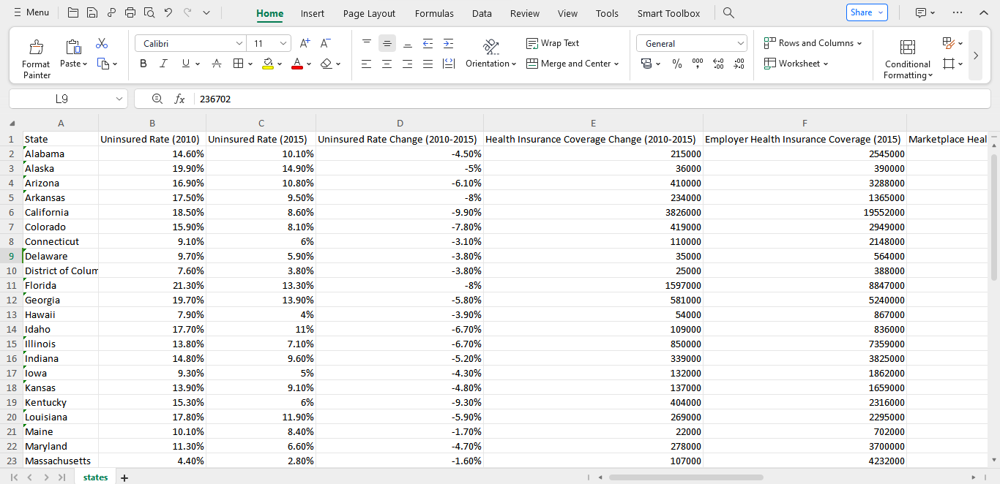
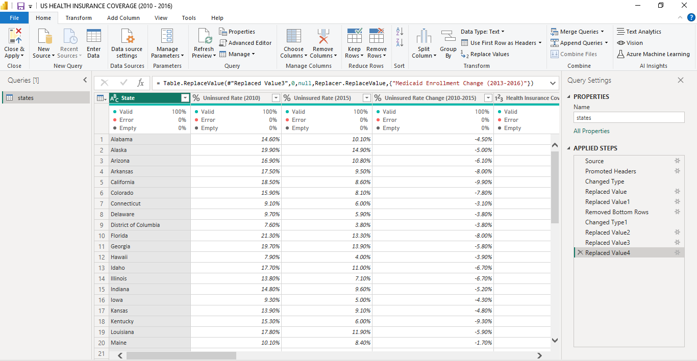

# US-Health-Insurance-Coverage-Analysis (2010-2016)

## Project Overview
### Introduction:
The Affordable Care Act (ACA), often colloquially referred to as Obamacare, stands as one of the most significant pieces of healthcare legislation in the United States in recent history. Enacted in March 2010 under the administration of President Barack Obama, the ACA aimed to address longstanding issues within the American healthcare system, including access, affordability, and quality of care. The period from 2010 to 2016 in the United States marked a significant chapter in healthcare. My project, "US Health Insurance Coverage Analysis (2010-2016)," dives into this era to uncover trends and impacts on coverage.

Through this data analysis, we aim to shed light on changes in uninsured rates, Medicaid enrollment, Medicare enrollment, marketplace exchanges, and employer-sponsored insurance. By understanding these trends, we hope to inform policymaking and contribute to ongoing efforts to improve healthcare access for all Americans. Join us as we draw insights from this popular health insurance coverage as we work towards a more equitable healthcare system.

### Objectives:
To conduct a comprehensive analysis of healthcare coverage metrics from 2010 to 2016, focusing on the top-performing states in various categories:
- Top States with the Most Declined Uninsured Rate (2010-2016): Identify and analyze the states that experienced the most significant reduction in uninsured rates over the six-year period. Investigate factors contributing to the decline in uninsured rates, such as Medicaid expansion, marketplace enrollment, and outreach initiatives.

- State Medicaid Expansion Enrollment Status (2016): Assess the Medicaid expansion status of states in 2016 and examine the impact of expansion on healthcare coverage and access.
Compare enrollment rates and healthcare outcomes between states that expanded Medicaid and those that did not.

- States with the Most Significant Medicaid Enrollment Change (2013-2016): Identify states with the largest changes in Medicaid enrollment from 2013 to 2016, including both increases and decreases. Explore factors driving changes in Medicaid enrollment, such as economic conditions, demographic shifts, and policy changes.

- States with the most significant Health Insurance Coverage Change (2010-2015): Analyze states with the most notable changes in health insurance coverage from 2010 to 2015, considering shifts in employer-sponsored coverage, Medicaid expansion, and marketplace enrollment. Examine variations in coverage change patterns across states and demographic groups.

- States by Average Monthly Credit (2016): Identify states where individuals received the highest average monthly tax credits for marketplace health insurance coverage in 2016.
Evaluate the effectiveness of tax credits in making health insurance coverage more affordable for residents.

- States by Marketplace Tax Credits (2016): Analyze states where individuals received the highest total amount of marketplace tax credits in 2016. Assess the distribution of tax credits across states and their impact on marketplace enrollment and affordability.

- States by Employee Health Insurance Coverage (2015), Marketplace Health Insurance Coverage (2016), Medicaid Enrollment (2016), and Medicare Enrollment (2016): Compare states based on levels of employee-sponsored health insurance coverage, marketplace enrollment, Medicaid enrollment, and Medicare enrollment. Examine variations in coverage sources and enrollment rates across states.

- Uninsured Rate Change By States (2010-2016): Create a geographic visualization of uninsured rate changes across states from 2010 to 2016. Highlight states with the most significant reductions or increases in uninsured rates and explore regional trends.

### Expected Outcome of Analysis Objectives:

- Top 10 States with the Most Declined Uninsured Rate (2010-2016): Identification of states with the most significant reductions in uninsured rates. Insights into factors contributing to the decline, such as Medicaid expansion and marketplace enrollment. Understanding of successful strategies for reducing uninsured rates that can inform future healthcare policy and outreach initiatives.

- State Medicaid Expansion Enrollment Status (2016): Assessment of Medicaid expansion's impact on healthcare coverage and access. Comparison of enrollment rates and healthcare outcomes between states that expanded Medicaid and those that did not.
  
- Top 10 States with the Most Significant Medicaid Enrollment Change (2013-2016): Identification of states experiencing the largest changes in Medicaid enrollment. Understanding of economic, demographic, and policy factors driving enrollment changes. Insights into the effectiveness of Medicaid expansion and other enrollment initiatives.

- Top 10 States by Health Insurance Coverage Change (2010-2015): Analysis of states with notable changes in health insurance coverage. Understanding of the impact of various factors, including Medicaid expansion and marketplace enrollment. Identification of demographic groups and regions experiencing the most significant shifts in coverage.

- Top 10 States by Average Monthly Credit (2016): Identification of states where individuals receive the highest average monthly tax credits. Assessment of the effectiveness of tax credits in improving affordability and access to health insurance. Insights into geographic and demographic patterns of tax credit distribution.

- Top 10 States by Marketplace Tax Credits (2016): Analysis of states where individuals receive the highest total amount of marketplace tax credits. Understanding of the distribution and impact of tax credits on marketplace enrollment and affordability. Identification of states with successful marketplace subsidy programs.

- Top 10 States by Employee Health Insurance Coverage (2015), Marketplace Health Insurance Coverage (2016), Medicaid Enrollment (2016), and Medicare Enrollment (2016): Comparison of states based on coverage sources and enrollment rates. Identification of variations in coverage and access across states and demographic groups. Insights into the effectiveness of different coverage programs and enrollment initiatives.

- Uninsured Rate Change By States (2010-2016): Geographic visualization highlighting states with significant reductions or increases in uninsured rates. Understanding of regional trends in uninsured rates and disparities in coverage. Identification of areas requiring targeted interventions to improve healthcare access and coverage.

### About The Dataset
This dataset provides health insurance coverage data for each state and the United Staes of America as a whole, including variables such as the uninsured rates before and after the Affordable Care Act (ACA) popularly known as Obamacare, estimates of individuals covered by employer and marketplace healthcare plans, and enrollment in Medicare and Medicaid programs. The health insurance coverage data was compiled from the US Department of Health and Human Services. The dataset can be viewed [here](states.csv)

This dataset contains 14 columns and 52 rows of data. Here's an overview of the dataset along with explanations of the column names:
- State: The geographic entity under scrutiny, representing the diverse regions of the United States.
- Uninsured Rate (2010): A measure of the percentage of individuals within a state who lacked health insurance coverage in the year 2010, revealing the extent of vulnerability within the population.
- Uninsured Rate (2015): Similar to the previous column but reflecting the uninsured rate in the year 2015, providing a snapshot of the progress or regress in access to healthcare over the five-year period.
- Uninsured Rate Change (2010-2015): The magnitude and direction of the change in uninsured rates from 2010 to 2015, offering insights into the efficacy of policies and initiatives aimed at expanding healthcare coverage.
- Health Insurance Coverage Change (2010-2015): A broader perspective on the evolution of health insurance coverage, encapsulating not only the uninsured but also those who gained or lost coverage over the five-year span.
- Employer Health Insurance Coverage (2015): The proportion of individuals covered by health insurance provided through their employers in the year 2015, highlighting the role of workplace-based coverage in the healthcare landscape.
- Marketplace Health Insurance Coverage (2016): The extent of health insurance coverage obtained through the marketplace exchanges established under the Affordable Care Act (ACA) in 2016.
- Marketplace Tax Credits (2016): Financial assistance provided to eligible individuals purchasing health insurance through the marketplace exchanges in 2016, easing the financial burden of obtaining coverage.
- Average Monthly Tax Credit (2016): The average amount of tax credits received by individuals enrolled in marketplace health insurance plans on a monthly basis in 2016, illuminating the affordability of coverage under the ACA.
- State Medicaid Expansion (2016): A binary indicator denoting whether a state chose to expand its Medicaid program under the ACA in 2016, a pivotal decision influencing access to healthcare for low-income individuals.
- Medicaid Enrollment (2013): The number of individuals enrolled in Medicaid, a federal and state program providing health coverage to eligible low-income individuals and families, in the year 2013.
- Medicaid Enrollment (2016): Similar to the previous column but reflecting Medicaid enrollment in the year 2016, illustrating changes in program participation over the three-year period.
- Medicaid Enrollment Change (2013-2016): The net change in Medicaid enrollment from 2013 to 2016, indicative of shifts in eligibility, enrollment procedures, and outreach efforts during this period.
- Medicare Enrollment (2016): The number of individuals enrolled in Medicare, a federal health insurance program primarily for people aged 65 and older, in the year 2016, highlighting the aging demographic landscape of the nation.

### Tools Used
1. Power Query Editor
    - Was used to:
        1. Extract,
        2. Transform, and
        3. Load all the datasets for this analysis.
           
2. Power BI (Was used to create reports and dashboard for this analysis)
    - The following Power BI Features were incorporated:
        1. DAX
        2. Quick Measures
        3. Page Navigation
        4. Filters
        5. Tooltips
        6. Button

### Data Cleaning, Transformation and Loading using the Power Query Editor:
1. Changed the column data type for "State" to text.
2. Changed the column data type for "Uninsured Rate (2020)", "Uninsured Rate (2015)", and "Uninsured Rate Change (2010-2015)" from whole number to percentage.
3. Changed the columns "Marketplace Tax Credits (2016)" and "Average Monthly Tax Credit (2016)" to currency data type from whole number.
4. Replaced a value in the "State Medicaid Expansion (2016)" from 0 to "False"
5. Removed the last dat row "United States" from the dataset to allow only the States to stand.
6. Transformed every other column type to its appropriate column type.

**Raw Data**
- Below a screenshot of a part of the raw data in .csv file format which cannot be fully viewed here. You can download the dataset [here](states.csv).

**Final Power Query Editor screenshot**
- Below is a screenshot of a part of the cleaned data in power query editor. You can access the full Power BI project document [here](US%20HEALTH%20INSURANCE%20COVERAGE%20(2010%20-%202016).pbix).

