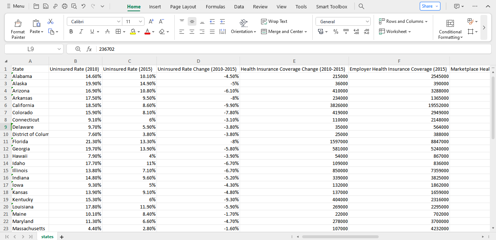
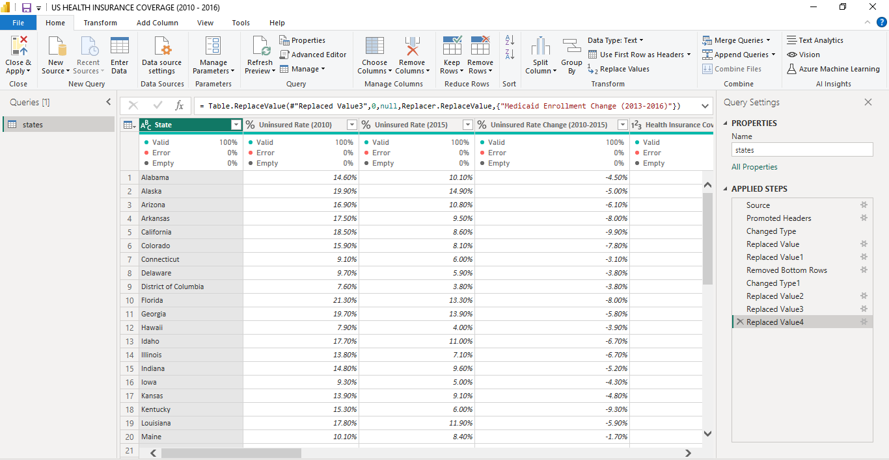
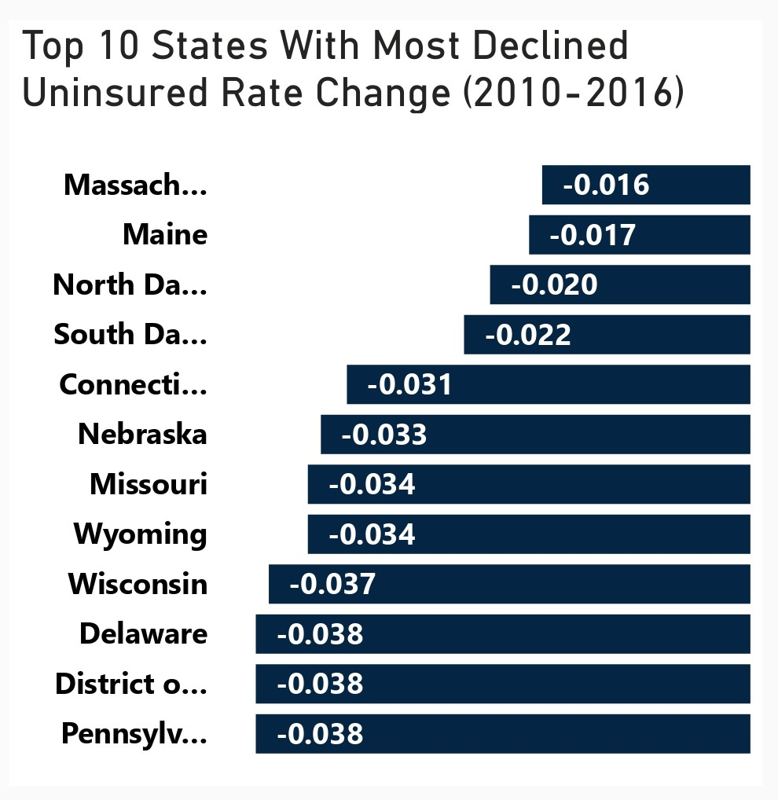
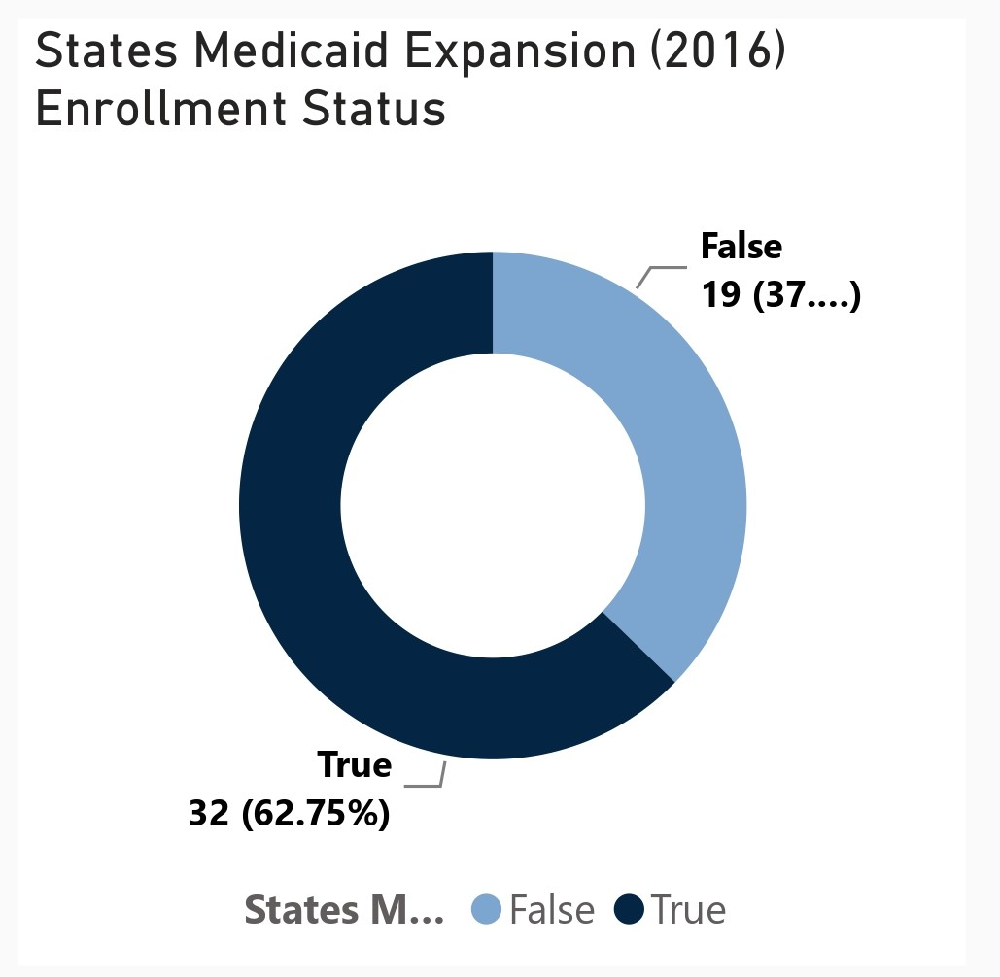
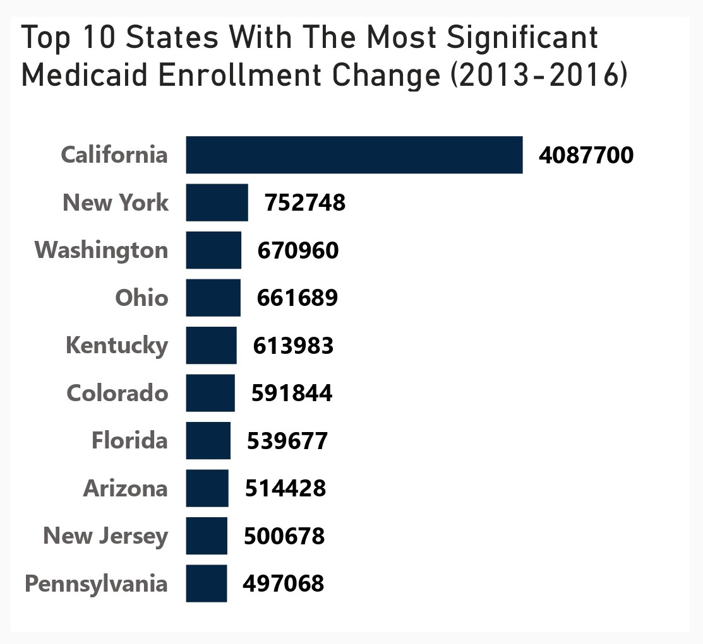
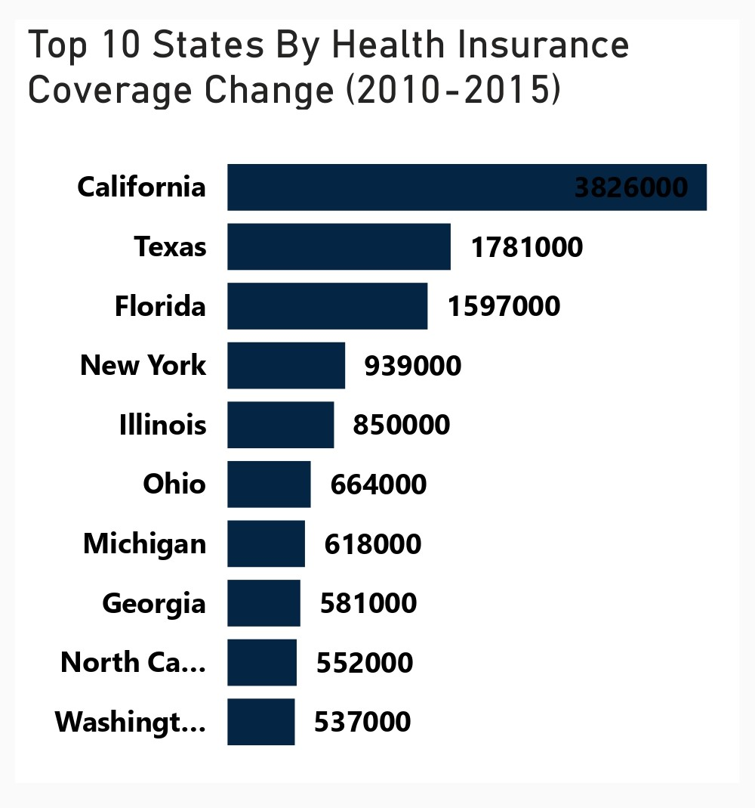
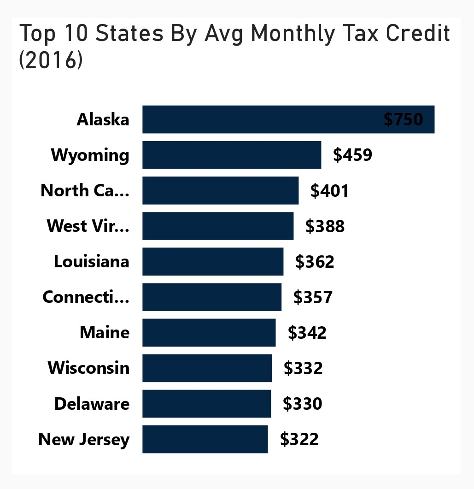
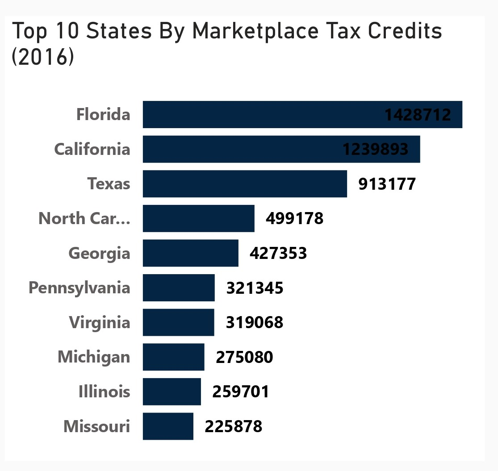
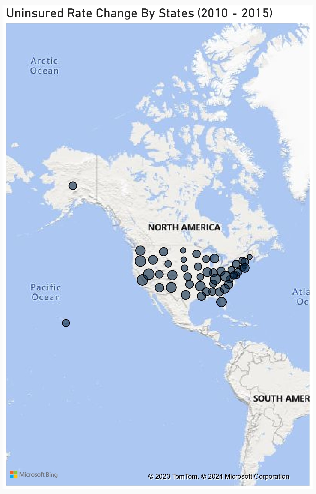

# US Health Insurance Coverage (2010-2016) Analysis

 

## Table of Contents
- [Project Overview](#project-overview)
- [About The Dataset](#about-the-dataset)
- [Tools Used](#tools-used)
- [Visualization in Power BI](#visualization-in-power-bi)
- [Project Analysis](#project-analysis)
- [Visuals in Power BI Report](#visuals-in-power-bi-report)
- [Predictions On What May happen To The Nationwide Uninsured Rate In The Next Five Years](#predictions-on-what-may-happen-to-the-nationwide-uninsured-rate-in-the-next-five-years)
 

## Project Overview
### Introduction:
The Affordable Care Act (ACA), often colloquially referred to as Obamacare, stands as one of the most significant pieces of healthcare legislation in the United States in recent history. Enacted in March 2010 under the administration of President Barack Obama, the ACA aimed to address longstanding issues within the American healthcare system, including access, affordability, and quality of care.

The period from 2010 to 2016 in the United States marked a significant chapter in healthcare. My project, __US Health Insurance Coverage Analysis (2010-2016)__, dives into this era to uncover trends and impacts on coverage.

Through this data analysis, we aim to shed light on changes in uninsured rates, Medicaid enrollment, Medicare enrollment, marketplace exchanges, and employer-sponsored insurance. By understanding these trends, we hope to inform policymaking and contribute to ongoing efforts to improve healthcare access for all Americans. Join us as we draw insights from this popular health insurance coverage as we work towards a more equitable healthcare system

### Objectives:
To conduct a comprehensive analysis of healthcare coverage metrics from 2010 to 2016, focusing on the top-performing states in various categories:

- Top States with the Most Declined Uninsured Rate (2010-2016): Identify and analyze the states that experienced the most significant reduction in uninsured rates over the six-year period. Investigate factors contributing to the decline in uninsured rates, such as Medicaid expansion, marketplace enrollment, and outreach initiatives.

- State Medicaid Expansion Enrollment Status (2016): Assess the Medicaid expansion status of states in 2016 and examine the impact of expansion on healthcare coverage and access. Compare enrollment rates and healthcare outcomes between states that expanded Medicaid and those that did not.

- States with the Most Significant Medicaid Enrollment Change (2013-2016): Identify states with the largest changes in Medicaid enrollment from 2013 to 2016, including both increases and decreases. Explore factors driving changes in Medicaid enrollment, such as economic conditions, demographic shifts, and policy changes.

- States with the most significant Health Insurance Coverage Change (2010-2015): Analyze states with the most notable changes in health insurance coverage from 2010 to 2015, considering shifts in employer-sponsored coverage, Medicaid expansion, and marketplace enrollment. Examine variations in coverage change patterns across states and demographic groups.

- States by Average Monthly Credit (2016): Identify states where individuals received the highest average monthly tax credits for marketplace health insurance coverage in 2016. Evaluate the effectiveness of tax credits in making health insurance coverage more affordable for residents.

- States by Marketplace Tax Credits (2016): Analyze states where individuals received the highest total amount of marketplace tax credits in 2016. Assess the distribution of tax credits across states and their impact on marketplace enrollment and affordability.

- States by Employee Health Insurance Coverage (2015), Marketplace Health Insurance Coverage (2016), Medicaid Enrollment (2016), and Medicare Enrollment (2016): Compare states based on levels of employee-sponsored health insurance coverage, marketplace enrollment, Medicaid enrollment, and Medicare enrollment. Examine variations in coverage sources and enrollment rates across states.

- Uninsured Rate Change By States (2010-2016): Create a geographic visualization of uninsured rate changes across states from 2010 to 2016. Highlight states with the most significant reductions or increases in uninsured rates and explore regional trends
 

### Expected Outcome of Analysis Objectives:

- Top 10 States with the Most Declined Uninsured Rate (2010-2016): Identification of states with the most significant reductions in uninsured rates. Insights into factors contributing to the decline, such as Medicaid expansion and marketplace enrollment. Understanding of successful strategies for reducing uninsured rates that can inform future healthcare policy and outreach initiatives.

- State Medicaid Expansion Enrollment Status (2016): Assessment of Medicaid expansion's impact on healthcare coverage and access. Comparison of enrollment rates and healthcare outcomes between states that expanded Medicaid and those that did not.

- Top 10 States with the Most Significant Medicaid Enrollment Change (2013-2016): Identification of states experiencing the largest changes in Medicaid enrollment. Understanding of economic, demographic, and policy factors driving enrollment changes. Insights into the effectiveness of Medicaid expansion and other enrollment initiatives.

- Top 10 States by Health Insurance Coverage Change (2010-2015): Analysis of states with notable changes in health insurance coverage. Understanding of the impact of various factors, including Medicaid expansion and marketplace enrollment. Identification of demographic groups and regions experiencing the most significant shifts in coverage.

- Top 10 States by Average Monthly Credit (2016): Identification of states where individuals receive the highest average monthly tax credits. Assessment of the effectiveness of tax credits in improving affordability and access to health insurance. Insights into geographic and demographic patterns of tax credit distribution.
  
- Top 10 States by Marketplace Tax Credits (2016): Analysis of states where individuals receive the highest total amount of marketplace tax credits. Understanding of the distribution and impact of tax credits on marketplace enrollment and affordability. Identification of states with successful marketplace subsidy programs.

- Top 10 States by Employee Health Insurance Coverage (2015), Marketplace Health Insurance Coverage (2016), Medicaid Enrollment (2016), and Medicare Enrollment (2016): Comparison of states based on coverage sources and enrollment rates. Identification of variations in coverage and access across states and demographic groups. Insights into the effectiveness of different coverage programs and enrollment initiatives.

- Uninsured Rate Change By States (2010-2016): Geographic visualization highlighting states with significant reductions or increases in uninsured rates. Understanding of regional trends in uninsured rates and disparities in coverage. Identification of areas requiring targeted interventions to improve healthcare access and coverage.
 
 

### About The Dataset
This dataset provides health insurance coverage data for each state and the United Staes of America as a whole, including variables such as the uninsured rates before and after the Affordable Care Act (ACA) popularly known as Obamacare, estimates of individuals covered by employer and marketplace healthcare plans, and enrollment in Medicare and Medicaid programs. The health insurance coverage data was compiled from the US Department of Health and Human Services. The dataset can be viewed [here](states.csv)

This dataset contains 14 columns and 52 rows of data. Here's an overview of the dataset along with explanations of the column names:

| Table                              | Field                    | Description                            |            
|:-----------------------------------|:------------------------ |:-------------------------------------- |
|States.csv                          | State                    | The geographic entity under scrutiny, representing the diverse regions of the United States.    |
|                                    | Uninsured Rate (2010)    | A measure of the percentage of individuals within a state who lacked health insurance coverage in the year 2010, revealing the extent of vulnerability within the population.     |
|                                    | Uninsured Rate (2015)    | Similar to the previous column but reflecting the uninsured rate in the year 2015, providing a snapshot of the progress or regress in access to healthcare over the five-year period.         |
|                                    | Uninsured Rate Change (2010-2015) | The magnitude and direction of the change in uninsured rates from 2010 to 2015, offering insights into the efficacy of policies and initiatives aimed at expanding healthcare coverage.         |
|                                    | Health Insurance Coverage Change (2010-2015) | A broader perspective on the evolution of health insurance coverage, encapsulating not only the uninsured but also those who gained or lost coverage over the five-year span.       |
|                                    | Employer Health Insurance Coverage (2015)    | The proportion of individuals covered by health insurance provided through their employers in the year 2015, highlighting the role of workplace-based coverage in the healthcare landscape.        |
|                                    | Marketplace Health Insurance Coverage (2016) | The extent of health insurance coverage obtained through the marketplace exchanges established under the Affordable Care Act (ACA) in 2016.        |
|                                    | Marketplace Tax Credits (2016)               | Financial assistance provided to eligible individuals purchasing health insurance through the marketplace exchanges in 2016, easing the financial burden of obtaining coverage.         |
|                                    | Average Monthly Tax Credit (2016)            | The average amount of tax credits received by individuals enrolled in marketplace health insurance plans on a monthly basis in 2016, illuminating the affordability of coverage under the ACA.         |
|                                    | State Medicaid Expansion (2016)              | A binary indicator denoting whether a state chose to expand its Medicaid program under the ACA in 2016, a pivotal decision influencing access to healthcare for low-income individuals.        |
|                                    | Medicaid Enrollment (2013)                   | The number of individuals enrolled in Medicaid, a federal and state program providing health coverage to eligible low-income individuals and families, in the year 2013.       |
|                                    | Medicaid Enrollment (2016)                   | Similar to the previous column but reflecting Medicaid enrollment in the year 2016, illustrating changes in program participation over the three-year period.         |
|                                    | Medicaid Enrollment Change (2013-2016)       | The net change in Medicaid enrollment from 2013 to 2016, indicative of shifts in eligibility, enrollment procedures, and outreach efforts during this period.        |
|                                    | Medicare Enrollment (2016)                   | The number of individuals enrolled in Medicare, a federal health insurance program primarily for people aged 65 and older, in the year 2016, highlighting the aging demographic landscape of the nation.        |
 
 

### Skills Utilized
1. Data Cleaning
2. Data Visualiziation
3. Descriptive Analytics
4. Critical Thinking and Problem Solving
5. Communication and Reporting
 

### Tools Used
1. Power Query Editor
    - Was used to:
        1. Extract,
        2. Transform, and
        3. Load all the datasets for this analysis.
           
2. Power BI (Was used to create reports and dashboard for this analysis)
    - The following Power BI Features were incorporated:
        1. DAX
        2. Quick Measures
        3. Page Navigation
        4. Filters
        5. Tooltips
        6. Button
 

### Data Cleaning, Transformation and Loading using the Power Query Editor:
1. Changed the column data type for __"State"__ to text.
2. Changed the column data type for __"Uninsured Rate (2020)"__, __"Uninsured Rate (2015)"__, and __"Uninsured Rate Change (2010-2015)"__ from whole number to percentage.
3. Changed the columns __"Marketplace Tax Credits (2016)"__ and __"Average Monthly Tax Credit (2016)"__ to currency data type from whole number.
4. Replaced a value in the __"State Medicaid Expansion (2016)"__ from 0 to "False"
5. Removed the last dat row __"United States"__ from the dataset to allow only the States to stand.
6. __Transformed__ every other column type to its appropriate column type.
 

**Raw Data**
- Below a screenshot of a part of the raw data in .csv file format which cannot be viewed fully here. You can download the dataset [here](states.csv).

 
 

**Final Power Query Editor screenshot**
- Below is a screenshot of a part of the cleaned data in power query editor. You can access the full Power BI project document [here](US%20HEALTH%20INSURANCE%20COVERAGE%20(2010%20-%202016).pbix).

 
 

## Data Modelling
No data modelling was required since we need just a table for the analysis.
 
 

## Visualization in Power BI:
#### Report 1
_Analysis_Dashboard1.jpg)

#### Report 2
_Analysis_Dashboard2.jpg)
 
 

### Project Analysis:
From the analysis, i made the Key Performance Indcator findings below:
- The Total Uninsured Rate Change (2010-2016) is __-277.%__.
- The Average Monthly Tax Credit (2016) is __$292.16__.
- Total Health Insurance Coverage Change (2010-2015) is __19.59M__.
- Total Employer Health Insurance Coverage (2015) is __172.29M__.
- Total Marketplace Health Insurance Coverage (2016) is __11.08M__.
- Total Marketplace Tax Credit is __$9.39M__.
- The Total Medicaid Enrollment (2016) is __73.53M__.
- The Total Medicare Enrollment (2016) is __55.89M__.
 
 

- 

- **The top 10 states with the most declined uninsured rate change from 2010 to 2016 are as follows:**
- In this analysis, Massachusetts tops the list of the top 10 States with the most declined uninsured rate change (2010-2016) with -0.016%, followed closely by Maine with -0.017%, North Dakota with -0.020%, South Dakota with -0.022%, Connecticut with -0.031%, Nebraska with -0.033%, Missouri with -0.034%, Wyoming with -0.034%, Wisconsin with -0.037%, and lastly, Delaware, District of Columbia and Pennsylvania with -0.038% each.
   - __Insights:__
     - __Medicaid Expansion:__ Several of the top-performing states, such as Massachusetts, Connecticut, and Delaware, have implemented Medicaid expansion under the Affordable Care Act 
       (ACA). This expansion provided coverage to more low-income individuals and families, contributing to the decline in uninsured rates.
     - __Marketplace Enrollment:_- States with successful marketplace enrollment initiatives, including Connecticut and the District of Columbia, saw increased access to affordable 
       health insurance options through marketplace exchanges. Subsidies and tax credits offered through these exchanges helped individuals afford coverage, leading to a reduction in 
       uninsured rates.
     - __Outreach and Education:__ States that actively promoted healthcare enrollment and conducted robust outreach and education campaigns, such as Massachusetts and Connecticut, 
       experienced greater success in reducing uninsured rates. These efforts helped raise awareness about available coverage options and eligibility criteria, encouraging more 
       individuals to enroll in health insurance plans.
     - __State-Specific Policies:__ Some states, like Massachusetts, have implemented state-specific healthcare reform initiatives prior to the ACA, laying the groundwork for expanded 
       coverage and improved access to care. These pre-existing policies, coupled with ACA provisions, contributed to significant declines in uninsured rates in these states.
     - __Economic Factors:__ Economic conditions and employment trends may also have influenced uninsured rate changes. States with stable economies and low unemployment rates, such as 
       North Dakota and Nebraska, may have seen fewer individuals without health insurance coverage due to increased access to employer-sponsored insurance and financial stability among 
       residents.
     - In conclusion, the decline in uninsured rates across these top 10 states can be attributed to a combination of Medicaid expansion, successful marketplace enrollment initiatives, 
       effective outreach and education efforts, state-specific policies, and favorable economic conditions. 
 
 

- 

- **States Medicaid Expansion (2016) Enrollment Status:**
- In this analysis, i compared Medicaid expansion enrollment status in states across the United States, highlighting differences in enrollment rates and potential healthcare outcomes between states that expanded Medicaid and those that did not.
  - __Medicaid Expansion Enrollment Status:__ Out of the total 51 states (including Washington D.C.), 32 states successfully enrolled in Medicaid expansion, representing a percentage 
    ratio of 62.75%. Conversely, 19 states chose not to expand Medicaid, accounting for a percentage ratio of 37.25%.
  - __Comparison of Enrollment Rates:__ States that expanded Medicaid have a significantly higher enrollment rate compared to those that did not. This indicates a greater number of low- 
    income individuals and families gaining access to healthcare coverage in expansion states. Expansion states benefited from federal funding under the Affordable Care Act (ACA) to 
    extend Medicaid eligibility to individuals with incomes up to 138% of the federal poverty level, leading to broader coverage and increased enrollment.
  - __Healthcare Outcomes:__ States that expanded Medicaid experienced positive healthcare outcomes, including:
    - __Reduced uninsured rates:__ Expansion states saw significant declines in uninsured rates due to increased Medicaid coverage, providing access to preventive care, chronic disease 
      management, and essential health services.
    - __Improved access to care:__ Expansion of Medicaid led to greater access to primary care providers, specialists, and hospital services for low-income individuals, resulting in 
      better health outcomes and reduced reliance on emergency care.
    - __Economic benefits:__ Expansion states realized economic benefits from increased federal funding, job creation in the healthcare sector, and reduced uncompensated care costs for 
      hospitals and providers.
  - __Impact of Non-Expansion:__ States that chose not to expand Medicaid may experience negative healthcare outcomes, including:
    - __Higher uninsured rates:__ Non-expansion states continue to have higher uninsured rates compared to expansion states, resulting in barriers to accessing timely and appropriate 
      healthcare services for low-income residents.
    - __Limited access to care:__ Residents in non-expansion states may face challenges in accessing affordable healthcare services, leading to delays in seeking medical care, poorer 
      health outcomes, and increased healthcare disparities.
    - __Financial strain:__ Non-expansion states may incur higher healthcare costs due to uncompensated care for uninsured individuals, placing additional strain on state budgets and 
      healthcare providers.
 
 

- 

- **Top 10 States With The Most Significant Medicaid Enrollment Change (2013-2016):**
- In this analysis, i focused on the analysis focuses on the top 10 states with the most significant Medicaid enrollment changes from 2013 to 2016, exploring the economic, demographic, and policy factors driving enrollment changes and drawing insights into the effectiveness of Medicaid expansion and other enrollment initiatives. California sits at the top of these top 10 States with a figure of 4,087,700 enrollment change, followed by New York with 752,748, Washington is next with 670,960, Ohio folliows with 661,089, Kentucky - 613,983, Colorado - 591,844, Florida - 539,677, Arizona - 514,428, New Jersey - 500,678, and last in the top 10 States is Pennsylvania with 497,068. 
  - __Factors Driving Enrollment Changes:__
    - __Economic Conditions:__ States experiencing economic growth or downturns may see corresponding changes in Medicaid enrollment. Economic factors such as unemployment rates, job 
      losses, and income levels influence individuals' eligibility and need for Medicaid coverage.
    - __Demographic Shifts:__ Changes in population demographics, including aging populations, migration patterns, and birth rates, can impact Medicaid enrollment. Demographic shifts 
      may increase demand for Medicaid services among certain age groups or communities.
    - __Policy Changes:__ Medicaid expansion under the Affordable Care Act (ACA) played a significant role in driving enrollment changes in many states. States that expanded Medicaid 
      eligibility to more low-income adults saw substantial increases in enrollment due to broader eligibility criteria and increased access to coverage.
    - __Outreach and Enrollment Initiatives:__ States that implemented proactive outreach and enrollment initiatives, including targeted marketing campaigns, simplified application 
      processes, and community-based enrollment assistance, experienced higher enrollment rates. These efforts helped raise awareness about Medicaid eligibility and facilitated 
      enrollment for eligible individuals.
  - __Insights into Medicaid Expansion and Enrollment Initiatives:__
    - __Effectiveness of Medicaid Expansion:__ States that expanded Medicaid eligibility under the ACA, such as California, New York, and Washington, experienced significant increases 
      in enrollment. Medicaid expansion provided coverage to millions of low-income adults who were previously ineligible, resulting in improved access to healthcare services and 
      reduced uninsured rates.
    - __Success of Outreach and Enrollment Initiatives:__ States that invested in outreach and enrollment initiatives, such as Colorado and Kentucky, saw notable enrollment gains. These 
      initiatives helped reach eligible individuals who may have been unaware of their eligibility or faced barriers to enrollment, such as language barriers or lack of access to 
      information.
 
 

- 

- **Top 10 States By HEalth Insurance Coverage Change (2010-2015):**
- This analysis focuses on the top 10 states with notable changes in health insurance coverage from 2010 to 2015, examining the impact of various factors such as Medicaid expansion and marketplace enrollment. It also identifies demographic groups and regions experiencing the most significant shifts in coverage. At the top of these top 10 States list is California with a figure of 3,826,000 medicaid enrollment change, followed by Texas with 1,781,000, Florida comes third with 1,597,000, New York follows next with 939,000, next is Illinois with 850,000, Ohio has 664,000, Michigan - 618,000, Georgia - 581,000, North Carolina has 552,000, and Washington has a figure of 537,000.
  - __Impact of Various Factors on Coverage Change:__
    - __Medicaid Expansion:__ States that expanded Medicaid eligibility under the Affordable Care Act (ACA), such as California and New York, experienced significant increases in health 
      insurance coverage. Medicaid expansion extended coverage to low-income adults who were previously ineligible, leading to reduced uninsured rates and improved access to healthcare 
      services.
    - __Marketplace Enrollment:__ States with successful marketplace enrollment initiatives, such as California and Florida, saw substantial increases in coverage through subsidized 
      health insurance plans offered on the marketplace exchanges. Tax credits and subsidies made coverage more affordable for individuals and families, leading to higher enrollment 
      rates.
    - __Economic Conditions:__ States with robust economic growth, such as California and Texas, experienced increases in employer-sponsored health insurance coverage as businesses 
      expanded and hired more employees. Improvements in employment rates and wages contributed to higher rates of coverage among working-age adults.
    - __Demographic Shifts:__ Certain demographic groups, such as young adults and minorities, experienced notable increases in coverage due to provisions under the ACA. Provisions 
      allowing young adults to stay on their parents' insurance plans until age 26 and outreach efforts targeting minority communities helped reduce disparities in coverage rates.
  - __Identification of Demographic Groups and Regions Experiencing Significant Shifts:__
    - __Young Adults:__ Provisions allowing young adults to remain on their parents' health insurance plans until age 26 led to increased coverage rates among this demographic group.
    - __Low-Income Adults:__ Medicaid expansion primarily benefited low-income adults who gained access to coverage through expanded eligibility criteria.
    - __Urban vs. Rural Areas:__ Urban areas with higher population densities tended to see greater increases in coverage compared to rural areas, where access to healthcare services 
      and insurance options may be more limited.
 
 

- 

- **Top 10 States By Average Monthly Tax Credits (2016):**
- In this analysis, my focus is on the top 10 states by average monthly tax credit in 2016, examining the effectiveness of tax credits in improving affordability and access to health insurance. It also provides insights into geographic and demographic patterns of tax credit distribution. At the top of this list is Alaska with a $750 average monthly tax credit, followed by Wyoming with $459, next is North Carolina with $388, Louisiana with $362, Connecticut with  $357, Maine with $342, Wisconsin with $332, Delaware with $330, and New Jersey with $322.
  - __Effectiveness of Tax Credits in Improving Affordability and Access:__
    - __Affordability:__ Tax credits provided financial assistance to individuals and families purchasing health insurance through marketplace exchanges, making coverage more 
      affordable. States with higher average monthly tax credits, such as Alaska and Wyoming, saw greater reductions in out-of-pocket costs for premiums, co-payments, and deductibles, 
      improving affordability for consumers.
    - __Access:__ Increased affordability facilitated higher enrollment rates in health insurance plans, expanding coverage and access to healthcare services. Individuals who previously 
      found coverage unaffordable were more likely to enroll in marketplace plans with the assistance of tax credits, resulting in reduced uninsured rates and improved access to 
      preventive care and medical treatment.
  - __Geographic and Demographic Patterns of Tax Credit Distribution:__
    - __Geographic Distribution:__ States with higher average monthly tax credits were often located in regions with higher healthcare costs or lower income levels. Rural states with 
      smaller populations, such as Alaska and Wyoming, tended to have higher tax credits to offset the higher costs of insurance.
    - __Demographic Distribution:__ Tax credits benefited individuals and families across various demographic groups, including low-income households, young adults, and older adults. 
      Younger individuals and families with lower incomes were more likely to qualify for higher tax credits, while older adults may receive smaller subsidies due to lower income 
      thresholds.
  - __Assessment of Effectiveness:__ Tax credits played a crucial role in making health insurance coverage more accessible and affordable for millions of Americans, particularly those 
    with lower incomes. States with higher average monthly tax credits experienced greater reductions in uninsured rates and increased enrollment in marketplace plans, leading to 
    improved health outcomes and financial security for individuals and families. However, disparities in tax credit distribution persist, with some states and demographic groups 
    receiving larger subsidies than others. Efforts to address these disparities and ensure equitable access to affordable coverage are essential for achieving universal healthcare 
    coverage.
 
 
 

- 

- **Top 10 States By Employer Health Insurance Coverage (2015), Marketplace Health Insurance Coverage (2016), and Medicaid Enrollment (2016), Medicare Enrollment (2016):**
- This analysis compares the top 10 states by employer health insurance coverage (2015), marketplace health insurance coverage (2016), Medicaid enrollment (2016), and Medicare enrollment (2016), highlighting variations in coverage sources and enrollment rates. It provides insights into the effectiveness of different coverage programs and enrollment initiatives and identifies variations in coverage and access across states and demographic groups.
  - __Comparison of States Based on Coverage Sources and Enrollment Rates:__
    - __Employer Health Insurance Coverage:__ States like California, New York, and Texas have the highest employer health insurance coverage rates, indicating a strong presence of 
      employer- sponsored insurance within their populations.
    - __Marketplace Health Insurance Coverage:__ California, Florida, and Texas show substantial enrollment in marketplace health insurance plans, indicating successful marketplace 
      initiatives and outreach efforts in these states.
    - __Medicaid Enrollment:__ New York, California, and Florida have the highest Medicaid enrollment rates, reflecting successful Medicaid expansion efforts and outreach programs 
      targeting low-income individuals and families.
    - __Medicare Enrollment:__ California, Texas, and Florida have significant Medicare enrollment numbers, likely due to larger populations of elderly residents and successful outreach 
      efforts to eligible individuals.
  - __Variations in Coverage and Access Across States and Demographic Groups:__ States with higher employer health insurance coverage rates may have lower enrollment rates in 
    marketplace plans or Medicaid, indicating reliance on employer-sponsored coverage. Medicaid expansion states generally have higher Medicaid enrollment rates and lower uninsured 
    rates compared to non-expansion states, demonstrating the impact of policy decisions on coverage outcomes. Rural areas and communities with lower income levels may have higher 
    Medicaid enrollment rates and reliance on marketplace plans due to limited access to employer-sponsored coverage. Young adults and low-income individuals may disproportionately rely 
    on marketplace plans and Medicaid for coverage, highlighting the importance of targeted outreach and enrollment initiatives for these demographic groups.
  - __Effectiveness of Different Coverage Programs and Enrollment Initiatives:__ Employer-sponsored insurance remains a significant source of coverage for many Americans, particularly 
    in states with high rates of employer health insurance coverage. Medicaid expansion has proven effective in increasing coverage rates and reducing uninsured rates in expansion 
    states, highlighting the importance of policy decisions in expanding access to healthcare. Marketplace exchanges have provided a vital avenue for individuals and families to access 
    affordable coverage, especially for those ineligible for employer-sponsored insurance or Medicaid.
  - Finally, variations in coverage sources and enrollment rates across states reflect the effectiveness of different coverage programs and enrollment initiatives. Understanding these 
    variations can inform targeted interventions and policy decisions aimed at improving coverage and access to healthcare services for all Americans, particularly those in underserved 
    communities and demographic groups.
 
 

- 

- **Uninsured Rate Change By States (2010-2015):**
- This final analysis focuses on the uninsured rate change by states from 2010 to 2015, utilizing geographic visualization to highlight states with significant reductions or increases in uninsured rates. It provides an understanding of regional trends in uninsured rates and disparities in coverage, identifying areas requiring targeted interventions to improve healthcare access and coverage.
  - __Geographic Visualization of Uninsured Rate Change:__ Geographic visualization, such as maps, can effectively illustrate variations in uninsured rates across states and regions 
    over time. States with significant reductions in uninsured rates will be highlighted in one color, while states with increases or minimal changes will be represented differently, 
    allowing for clear visual interpretation of trends.
  - __Understanding Regional Trends in Uninsured Rates:__ Regional trends may emerge, with certain areas experiencing more substantial reductions in uninsured rates compared to others. 
    For example, states in the Northeast and West Coast may show greater improvements in coverage due to factors such as Medicaid expansion and robust marketplace enrollment. 
    Conversely, states in the South and Midwest may exhibit slower progress in reducing uninsured rates, potentially due to lower Medicaid eligibility thresholds, resistance to Medicaid 
    expansion, or economic challenges.
  - __Disparities in Coverage:__ Geographic visualization can highlight disparities in coverage between urban and rural areas, as well as among different demographic groups. Urban areas 
    may show lower uninsured rates compared to rural areas, where access to healthcare services and insurance options may be more limited. Racial and ethnic disparities in coverage may 
    also be evident, with minority communities facing higher uninsured rates compared to non-Hispanic white populations.
  - __Identification of Areas Requiring Targeted Interventions:__ States or regions with persistently high uninsured rates or minimal improvements over time may require targeted 
    interventions to improve healthcare access and coverage. Policy measures such as Medicaid expansion, increased funding for outreach and enrollment assistance, and investments in 
    healthcare infrastructure can help address gaps in coverage and improve access to care in underserved areas. Collaborative efforts between federal, state, and local governments, 
    healthcare providers, and community organizations are essential in implementing effective interventions and reducing disparities in coverage.
 
 

## Visuals in Power BI Report:
You can view and interact with this dashboard report on US Health Insurance Coverage (2010-2016) [here](https://app.powerbi.com/view?r=eyJrIjoiYTczNmI4N2MtMTkzOC00ZWQwLTkxZDYtZmQyOTBlOWYyN2VmIiwidCI6IjdlYzI5NjU5LTNjZjItNGYzZi1hYmIzLWE3MjJlZGY3ZmYyZCJ9).
 
 
 

## Predictions On What May Happen To The Nationwide Uninsured Rate In The Next Five Years
Predicting the nationwide uninsured rate over the next five years involves considering various factors, including healthcare policy changes, economic conditions, demographic shifts, and public health crises. However, without specific data or information on future developments, any prediction would be speculative. That said, several potential scenarios could impact the uninsured rate:
- __Healthcare Policy Changes:__ Future changes in healthcare policy, such as modifications to the Affordable Care Act (ACA), Medicaid expansion, or the implementation of universal 
healthcare initiatives, could significantly influence the uninsured rate. For example, expanding Medicaid eligibility or introducing subsidies for marketplace plans could lead to lower uninsured rates.
- __Economic Conditions:__ Economic factors, such as employment levels, wages, and overall economic stability, play a crucial role in determining the uninsured rate. A robust economy with low unemployment rates may result in higher rates of employer-sponsored insurance and lower uninsured rates.
- __Demographic Trends:__ Changes in the demographic composition of the population, such as aging populations or shifts in immigration patterns, can impact the uninsured rate. For instance, an aging population may lead to increased Medicare enrollment, while changes in immigration policies could affect the uninsured rates among non-citizens.
- __Public Health Events:__ Public health events, such as pandemics or natural disasters, can have unforeseen impacts on healthcare access and coverage. The COVID-19 pandemic, for example, led to job losses and subsequent increases in the uninsured rate as individuals lost employer-sponsored coverage.
- __Policy Responses:__ Government responses to emerging healthcare challenges, such as the implementation of public health insurance programs or initiatives to address healthcare disparities, can influence the uninsured rate. Policy interventions aimed at increasing coverage and improving healthcare access may lead to reductions in the uninsured rate.
- Considering the dynamic nature of these factors and the uncertainty surrounding future events, predicting the nationwide uninsured rate with certainty is challenging. However, ongoing monitoring of healthcare policy developments, economic trends, and demographic changes can provide insights into potential shifts in the uninsured rate over time.
 
 

## Thank You For Following Through!
